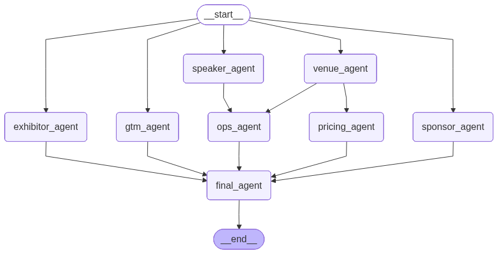

# 🚀 EventForge AI

**EventForge AI** is a multi-agent system that automates end-to-end conference planning -- from sponsors and speakers to venues, pricing, operations, and go-to-market strategy.

---

## ✨ Overview

Planning a conference involves multiple interdependent decisions across sponsorships, speakers, logistics, and pricing. EventForge AI solves this using **specialized agents** coordinated via a DAG, producing a structured, data-driven event plan in seconds.

---

## 🧠 Architecture

```text
.
├── app.py                         # Streamlit UI (interactive demo + live agent streaming)
├── eventforge_graph.png           # Visualized LangGraph DAG (generated via Mermaid)
├── pyproject.toml                 # Dependencies + packaging config
├── README.md                      # Project overview, setup, usage

└── src/
    └── eventforge/
    
        ├── main.py                # CLI entrypoint (runs pipeline without UI)

        ├── graph/
        │   ├── builder.py         # Core DAG definition (LangGraph orchestration)
        │   └── nodes.py           # (Optional) shared node utilities / abstractions

        ├── agents/
        │   ├── base/
        │   │   ├── base_agent.py      # Abstract agent class (state-in → state-out contract)
        │   │   └── agent_registry.py  # (Optional) agent lookup / extensibility layer
        │   │
        │   ├── sponsor_agent.py   # Finds relevant sponsors
        │   ├── speaker_agent.py   # Recommends speakers
        │   ├── venue_agent.py     # Filters + ranks venues (data + scoring)
        │   ├── pricing_agent.py   # Pricing strategy + revenue estimation
        │   ├── ops_agent.py       # Scheduling + logistics planning
        │   ├── exhibitor_agent.py # Suggests exhibitors for booths
        │   ├── gtm_agent.py       # Go-to-market / promotion strategy
        │   └── final_agent.py     # Aggregates all agent outputs → final plan

        ├── models/
        │   ├── schemas.py         # Pydantic schemas for agent outputs
        │   ├── state.py           # Shared global state (LangGraph memory)
        │   └── pricing_model.py   # Pricing heuristics / calculations

        ├── tools/
        │   ├── web_search.py      # Tavily-based async search tools
        │   └── data_loader.py     # Dataset loading utilities (venues/events)

        ├── utils/
        │   ├── llm_client.py      # LLM factory (OpenRouter / Groq / etc.)
        │   ├── logging.py         # Structured logging (terminal + debug)
        │   ├── grounding.py       # Builds grounded context from search results
        │   └── validator.py       # Output cleaning + validation helpers

        └── data/
            ├── venues.csv         # Structured venue dataset (used by VenueAgent)
            └── events.csv         # (Optional) reference/historical events
  
```

## 📊 Execution Graph


---

## 🧠 Key Features

- 🤖 **Multi-Agent System**
  - Sponsor Agent → sponsor discovery
  - Speaker Agent → speaker recommendations
  - Venue Agent → venue selection (data + scoring)
  - Pricing Agent → pricing + revenue modeling
  - Ops Agent → scheduling + logistics
  - Exhibitor Agent → exhibitor suggestions
  - GTM Agent → marketing & distribution
  - Final Agent → aggregation layer  

- ⚡ Parallel + dependency-aware execution
- 📊 Structured, explainable outputs  
- 🔄 Modular and extensible design  

---

## ⚙️ How It Works
User Input → LangGraph DAG → Parallel Agents → Dependency Resolution → Final Aggregation

1. User provides event details (type, budget, attendees, location)  
2. Agents run in parallel to solve specific tasks  
3. Dependency-aware nodes (pricing, ops) execute after required inputs
4. Final agent aggregates all outputs into a unified plan 

---

## 📥 Input

- Conference category
- Geography
- Audience size
- Budget (optional)
- Duration (optional)

---

## 📤 Output

A complete AI-generated event plan including:

- 🤝 Sponsors
- 🎤 Speakers
- 🏛️ Venues
- 🧩 Exhibitors
- 💰 Pricing strategy
- 📅 Event schedule (ops)
- 📣 Go-to-market strategy 

---

## ⚙️ Tech Stack

- LangGraph (multi-agent orchestration)
- LangChain (LLM abstractions)
- Pydantic (structured outputs)
- Streamlit (UI)
- Async Python (parallel execution)
- Tavily API (web search grounding)

---

## 🚀 Getting Started

### 1. Clone the repository
```bash
git clone https://github.com/odysseus7X/eventforge-ai.git
cd eventforge-ai
```

### 2. Install Dependencies
```bash
pip install -e .
```

### 3. Set up environment variables
Create a .env file
```bash
LLM_API_KEY=your_llm_key
LLM_MODEL=openai/gpt-4o-mini
LLM_BASE_URL=https://openrouter.ai/api/v1

TAVILY_API_KEY=your_tavily_key
```

### 4. Run the application


-🖥️ Streamlit UI
```bash
streamlit run app.py
```

-💻CLI (terminal execution)
```bash
python src/eventforge/main.py
```

## 🧠 One-line summary
#### Modular multi-agent system where independent agents coordinate via a shared state graph to generate a complete event plan.